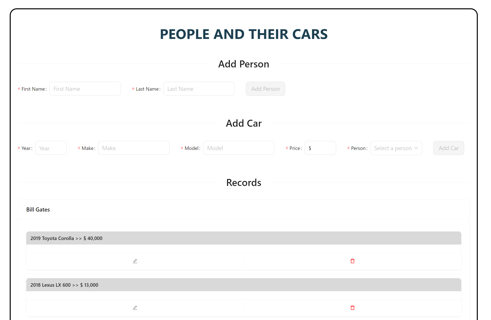

# People and their cars (React + Apollo + GraphQL)

The app is designed to manage a list of people and the cars they own. It allows users to perform CRUD operations (Create, Read, Update, Delete) for both people and cars.

Overall, the app facilitates the management of people and cars, providing an intuitive user interface for adding, editing, and viewing their details.

[](https://skillicons.dev)

## Features

- Person Form: Already included in the boilerplate, it captures first name and last name of a person.

- Car Form: Captures details about a car including year, make, model, price, and the person it belongs to (selected from a dropdown list of person names).

- Person Card: Displays a person's first and last name with options to edit or delete the person. Clicking the edit button switches to a form for editing that person. There's also a "LEARN MORE" link to view a separate show page with detailed information about that person and their cars.

- Car Card: Displays car details such as year, make, model, price, and the person it belongs to. Car cards are displayed as sub-cards within the corresponding person's card. It includes edit and delete options. Clicking edit switches to a form for editing that car.

- Show Page: Displays detailed information about a person and the cars they own. It includes a "GO BACK HOME" link to return to the home page with both forms and lists of people and cars.

## Installation :floppy_disk:

Install my-project with npm

```bash
  npm install my-project
  cd my-project
```

- Server folder     
```bash
  cd server
  npm start
```

- Client folder     
```bash
  cd client
  npm run dev
```
## Authors :black_nib:

- [@alvelx](https://github.com/alvelx)


## Screenshots



